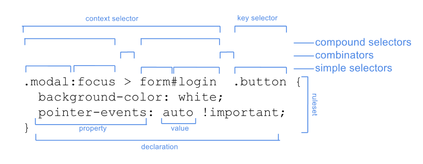

# CSS and HTML resources for a friend.

## Learn selectors as soon as possible.

- [Good article that tells you how to select most things.](https://code.tutsplus.com/tutorials/the-30-css-selectors-you-must-memorize--net-16048)
- [Great reference and quiz.](https://frontend30.com/css-selectors-cheatsheet/)

## Very important tutorials

- [Media queries are very important.](https://www.w3schools.com/css/css_rwd_mediaqueries.asp)
- [Here are some very important html elements. Try to use the best ones for the job.](https://developer.mozilla.org/en-US/docs/Web/HTML/Element)

## CSS generators.

It often a bad idea to use a generator however sometimes they can be helpful.

- [box-shadow](https://www.cssmatic.com/box-shadow)
- [gradient](https://cssgradient.io/)
- [border-radius](https://www.cssmatic.com/border-radius)
- [transform](https://makingcss.com/transform.html)

## Layout references

Layout is hard but it is one of the most powerful thing you can learn.

- [Floats are the most basic layout tools.](https://developer.mozilla.org/en-US/docs/Web/CSS/float)
- [Flexbox is more complex but far more powerful.](https://css-tricks.com/snippets/css/a-guide-to-flexbox/)
- [The most powerful and most complex](https://css-tricks.com/snippets/css/complete-guide-grid/)

## Useful sites

- [Best site for CSS stuff + everything web development](https://developer.mozilla.org/en-US/)
- [Very interesting place CSS tutorials](https://css-tricks.com/)
- [This site is not the best but it is still very helpful if you cant find what you want on developer.mozilla.org](https://www.w3schools.com/cssref/default.asp)

## Useful images.

